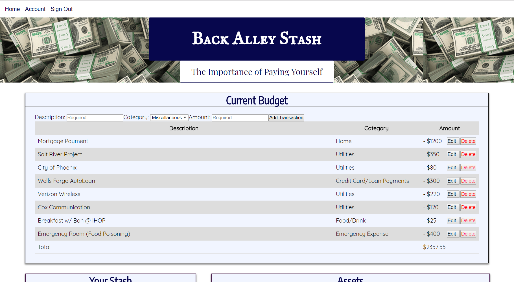

#

<h1>

Back Alley Stash

</h1>

### <i>Back Alley Stash</i> is a financial app that not only tracks your spending but encourages you to pay yourself as well. Every time you enter an expense, our app will automatically subtract another dollar (or other amount determined by the user) from your running total for the month. At the end of the month you login to your bank account and transfer that amount to your actual savings account (That’s your <i>Back Alley Stash</i>).

---
[CLICK ME to see it in action](https://back-alley-stash.herokuapp.com/)
 

---
 

  

---

This Project was developed and is maintained by the Brogrammers Team, to get help contact: 

- Daniel Olivas (github: olivas1406) 
    me@danielolivas.net [http://www.danielolivas.net](http://www.danielolivas.net)  
- Bon Erick Silvallana (github: bsilvall) 
    erick_malas95@hotmail.com  
- Andrew Nowlin (github: AndewNowlin) 
    flysparky@cox.net [https://www.linkedin.com/in/andrew-nowlin/](https://www.linkedin.com/in/andrew-nowlin/)  
- Dan Shook (github: danshook)
